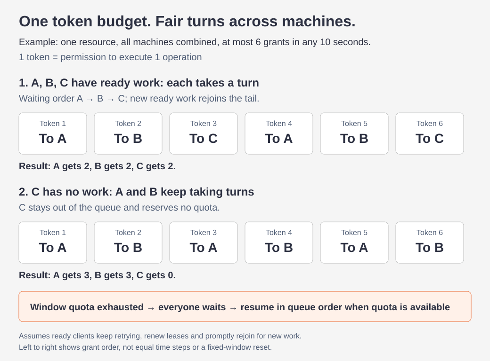
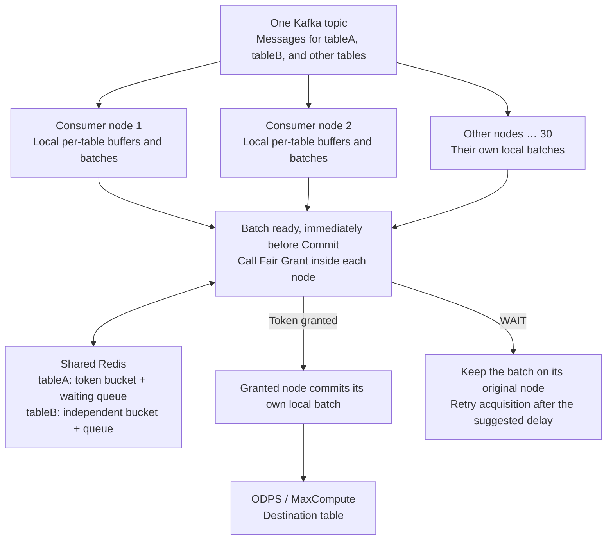

# Fair Grant Rate Limiter

English | [中文](README.zh-CN.md)

[](https://github.com/longxiaoyun/fair-grant-rate-limiter/actions/workflows/ci.yml)
[](LICENSE)

**Fair token-bucket allocation across machines within a time window and a fixed token budget.**

Built with Java, Redis and Lua. Machines accessing the same resource share a token quota, acquire tokens in waiting order, and execute their own tasks when granted.

## How are tokens distributed?

Machines A, B and C share one token bucket: **at most 6 tokens in a 10s window**. Each token permits one operation. Configure this window with `slidingWindow(10_000L, 6)`.



The figure shows grant order in two independent scenarios. Actual grant times also depend on token refill and task readiness. FIFO applies to waiting clients that keep retrying and renewing their leases.

## Features

- **Shared resource quotas**: all clients of a resource share one token bucket with a configured refill rate and burst capacity. Different resources have independent quotas.
- **FIFO allocation**: clients with valid waiting leases receive tokens in queue order. A grant removes the client from its current turn; new work joins the tail.
- **Optional strict rolling window**: cap new grants within any configured duration, such as at most 75 grants in 15 seconds, alongside the token bucket.
- **Acquisition retry deduplication**: retry an acquisition using its request ID within the receipt retention period without consuming quota again.
- **Non-blocking integration**: acquisition returns a grant result or a suggested retry delay; the application schedules execution and retries.

Requires Java 8+ and Redis 5+. Integrates as a Java library without a separate token distribution service.

## Why this library exists

The project comes from a Kafka → ODPS (MaxCompute) ingestion pipeline.

### One topic carries data for many tables

Each Kafka message contains the destination ODPS table, its structure and the row data. Messages for different tables share a topic, for example:

```json
{"project":"demo","table":"tableA","tableSchema":[{"name":"id","type":"bigint"}],"data":{"id":101}}
{"project":"demo","table":"tableB","tableSchema":[{"name":"event","type":"string"}],"data":{"event":"login"}}
{"project":"demo","table":"tableA","tableSchema":[{"name":"id","type":"bigint"}],"data":{"id":102}}
```

This illustrates the information carried by messages; the library does not prescribe a message format.

### Thirty consumers build their own per-table batches

Suppose thirty nodes consume the topic. Each node groups rows by destination table in its own memory and prepares a batch when its application-defined size or age threshold is reached.

Several nodes may receive rows for tableA, so several independent local batches can be ready to commit to the same table:

| Node | Local tableA buffer | Local tableB buffer |
|---|---|---|
| Node 1 | 6,000 rows, ready to commit | Still accumulating |
| Node 2 | 8,000 rows, ready to commit | No data |
| … | … | … |
| Node 30 | 3,000 rows, ready to commit | Another batch ready |

**Node 1's tableA batch is not merged with node 2's batch.** They share the destination table's commit quota because both are committed to the same ODPS table.

### The table has a shared commit limit

The MaxCompute documentation lists **75 write Commit calls per table per 15 seconds**. This example commits through Tunnel `UploadSession.commit`. Commits to tableA from all thirty nodes count together; each node does not receive a separate allowance of 75. [Official Data Transmission Service limits](https://help.aliyun.com/zh/maxcompute/overview-of-dts)

These are **Commit calls, not Kafka messages or data rows**. A batch of 6,000 rows that uses one Commit needs one token. TableB has its own quota.

Two things must therefore work together:

1. **Shared control per table:** every node committing tableA uses tableA's token bucket.
2. **Fair distribution across nodes:** consumers with ready tableA batches take turns, rather than allowing the most frequent applicant to keep obtaining the tokens.

## Where does Fair Grant fit?



Fair Grant is a library embedded in each Java process, not another service to deploy. Redis stores token and waiting state; consumers retain ownership of messages, table structures and batch data.

**Acquire after a batch is ready and immediately before its actual Commit.** Do not acquire for each Kafka message or reserve a queue position for a batch that cannot yet commit.

## How are tokens distributed fairly?

Suppose nodes 1, 2 and 3 have ready tableA batches and join its waiting queue in that order:

| Token | Recipient | Next action |
|---|---|---|
| First | Node 1 | Commit its tableA batch; rejoin the tail when another batch is ready. |
| Second | Node 2 | Commit its own tableA batch. |
| Third | Node 3 | Commit its own tableA batch. |
| Subsequent | The current ready waiter at the head | Continue in waiting order. |

If all thirty nodes continuously have ready batches and renew/retry normally, they take turns. At a smooth five tokens per second, a full round of thirty nodes would ideally take about six seconds; this is not a promise about commit completion time.

If only three nodes have ready batches, only those three participate. No quota is reserved for the other twenty-seven idle nodes. Waiting for tableA does not consume tableB's tokens.

Fairness is per **consumer node with a ready batch for the same destination table**, not weighted by Kafka partition, message count or batch row count.

## General-purpose concepts behind the example

| Concept | Meaning | Kafka → ODPS example |
|---|---|---|
| `resourceKey` | Which operations share one quota | Complete destination table identity |
| `clientId` | Which client receives a fair turn | Stable consumer process identity |
| Ready work | An operation that can execute after a grant | A local batch prepared for commit |
| One token | One opportunity to perform a controlled operation | One `UploadSession.commit` call attempt |
| `ratePerSec` / `burst` | Refill rate and capacity for the resource | Settings derived from the table's commit quota |

The same mechanism can coordinate services sharing one third-party API account, or workers sharing a service's call quota. Use the appropriate quota identity as the resource key, then perform your own operation after a grant. Fairness concerns operation opportunities, not data volume; it does not limit the number of operations in flight.

**ODPS is a real use case. Shared per-resource quota and fair distribution among waiting clients are the library's responsibilities.**

## ODPS example: the 75-per-15-second limit and token-bucket configuration

`75 / 15 = 5` gives a refill rate, but **five tokens per second on average is not automatically a guarantee of at most 75 commits in every 15-second window**. Burst capacity and actual commit timing also matter.

Add `.slidingWindow(15_000L, 75)` to enforce a strict rolling window. One Redis Lua operation checks token availability, new grants in the last 15 seconds, and the FIFO queue head. A new grant requires all three checks to pass. Even with `rate=5, burst=5`, every interval `(t−15s, t]` contains at most 75 new grants.

The example combines `burst=1` for smoothing with the strict window. Duration and count are application settings; no ODPS-specific rule is built in. Without this option, the library remains a fair token bucket.

The window covers **new grant timestamps in Redis**. Execute promptly and acquire new quota for each business retry; SDK-internal retries must also be accounted for. `FairGrantExecutor` acquires fresh quota and immediately invokes one operation, but network timing and SDK behavior still require application integration testing.

The cited quota concerns per-table write Commit calls. Other Catalog API metadata methods have their own limits; do not apply this number to every Catalog method. [Catalog API limits](https://help.aliyun.com/en/maxcompute/catalogapi-sdk-user-guide)

## Integrating with existing consumers

Requires Java 8+ and Redis 5+. The package is not on Maven Central yet. Run `mvn clean install` in this repository, then add:

```xml
<dependency>
  <groupId>io.github.longxiaoyun</groupId>
  <artifactId>fair-grant-rate-limiter</artifactId>
  <version>1.0.0-SNAPSHOT</version>
</dependency>
```

### 1. Create one limiter per consumer process

```java
import io.github.longxiaoyun.fairgrant.*;
import java.util.UUID;

FairGrantConfig config = FairGrantConfig.builder()
    .keyPrefix("odps:commit:")
    .ratePerSec(5.0) // Token refill rate per table across ALL nodes
    .burst(1.0)     // Smooth grants instead of accumulating commit tokens
    .slidingWindow(15_000L, 75) // At most 75 new grants in any 15 seconds
    .fallbackMode(FairGrantConfig.FallbackMode.DENY)
    .build();

// Local demo address; all thirty deployed nodes must connect to the same Redis service.
RedisFairGrantLimiter limiter = FairGrantLimiters.redis("127.0.0.1", 6379, config);
String clientId = UUID.randomUUID().toString(); // Generate once at process startup
```

The process shares this limiter across tables. Different resourceKeys select independent table buckets.

| Parameter | Value |
|---|---|
| `resourceKey` | Complete destination table identity, such as `demo:tableA`, identical across nodes. Include project, schema namespace and table when schema namespaces are enabled. |
| `clientId` | Stable, unique consumer process identity; distinguish multiple JVMs on one host. |

Do not append Kafka partition, the message's column-structure hash, local batch ID or ODPS partition value to a table's quota key: that would split one table into independent buckets. The column structure carried in a message is distinct from a MaxCompute schema namespace. Resource names are lowercased.

### 2. Acquire for a ready batch immediately before Commit

For Tunnel, acquire at this boundary: create UploadSession → write blocks and close the writer → acquire a commit token → `UploadSession.commit(blocks)`. Do not acquire before a lengthy upload. [Official interface documentation](https://help.aliyun.com/en/maxcompute/uploadsession)

Assume the application has selected and fixed a `readyBatch`, with all preparation required before the actual Commit complete:

```java
String resourceKey = "demo:tableA"; // Derive from readyBatch's destination table identity
FairGrantExecutor executor = new FairGrantExecutor(limiter);
AcquireResult result = executor.tryExecute(resourceKey, clientId,
    () -> commitPreparedBatchOnce(readyBatch));

if (result.getStatus() == AcquireResult.Status.ERROR) {
    retainBatchAndAlert(readyBatch, result.getDetail());
} else if (!result.isGranted()) {
    scheduleSameBatch(readyBatch, result.getRetryAfterMs()); // Keep locally; acquire again later
}
```

These three business methods belong to your consumer; they are not Kafka/ODPS APIs provided by the library. Use one submission coordinator per node/table to prevent two threads from committing the same batch.

- **One token covers one actual Commit attempt.** If Commit fails and another call is needed, acquire a new token instead of reusing one grant for unlimited retries.
- Both acquisition and Commit can involve network waits. Do not sleep for tokens on the Kafka poll thread; use your batch scheduler for retries.
- Keep the batch on WAIT. Memory bounds, consumer pause/resume and safe Kafka offset advancement are application responsibilities; buffering a message in memory is not durable ODPS delivery.
- When cancelling waiting work, call clearPending only if this node has no other ready batches for that table. No token release is needed after a normal grant.
- On Redis failure, this example uses DENY to pause grants. LOCAL_SHARE and ALLOW cannot preserve the global per-table quota guarantee.

## Scope and further reading

The repository provides **shared per-resource token buckets and fair token distribution among clients with ready work**. It does not own Kafka consumption, table-structure parsing, local batching, ODPS Commit or offset management.

- [Review against the actual Kafka → ODPS scenario (Chinese)](docs/scenario-review.zh-CN.md)
- [Configuration, acquisition retries, waiting leases and internals](docs/reference.md)
- [Migration](docs/reference.md#migrating-from-the-old-snapshot): old implementations, v2 and the current v3 protocol must not run together.

## Development and tests

```bash
mvn clean test
mvn -Preal-redis clean verify
```

The second command requires a local redis-server. It starts temporary Redis instances and validates multi-JVM grants and test HTTP calls. It does not connect to production Kafka or ODPS and does not replace validation of the actual ingestion pipeline. See [test coverage](docs/reference.md#build-and-end-to-end-validation).

[Apache License 2.0](LICENSE).
