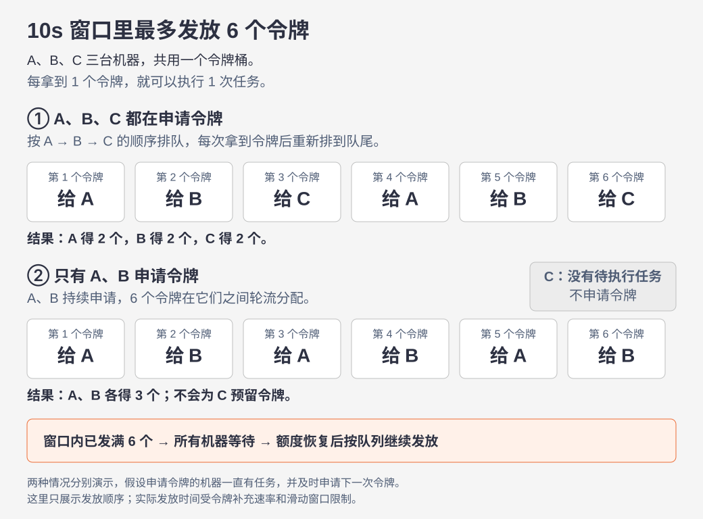
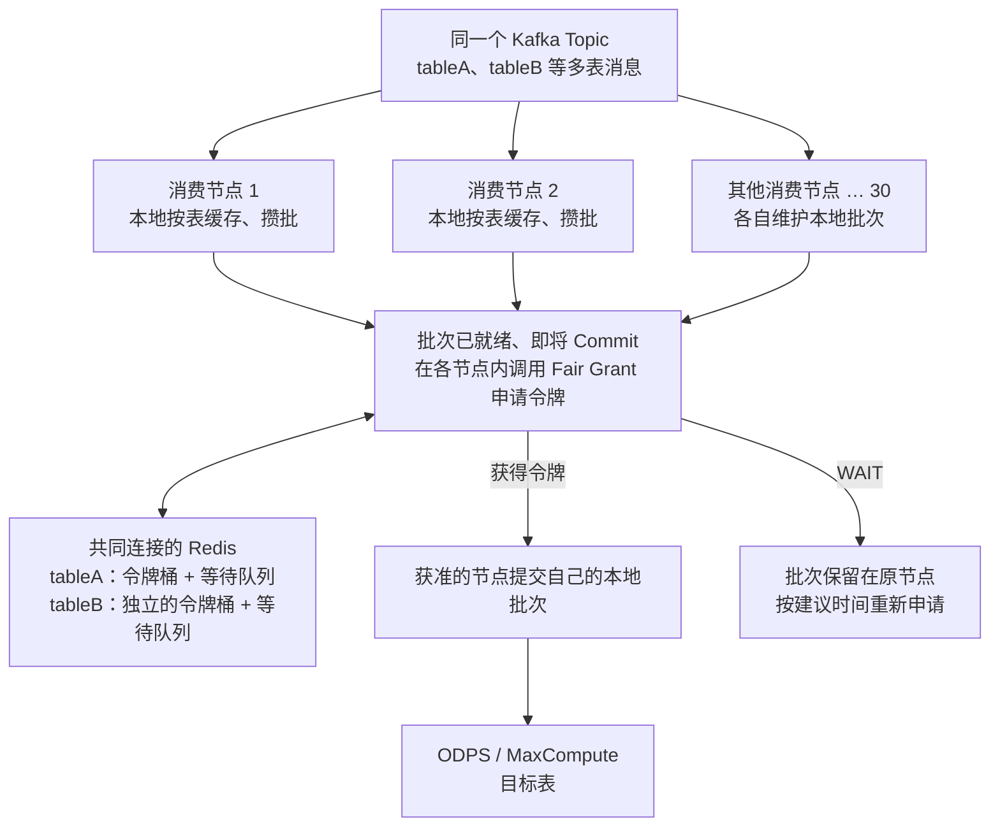

# Fair Grant Rate Limiter

[English](README.md) | 中文

[](https://github.com/longxiaoyun/fair-grant-rate-limiter/actions/workflows/ci.yml)
[](LICENSE)

**公平令牌桶分发，解决在时间窗口里给多机器公平分发固定令牌的问题。**

基于 Java、Redis 和 Lua 实现。同一资源的多台机器共享令牌配额，按等待顺序获取令牌，获准后执行各自的任务。

## 令牌如何分发？

下面将配额简化为“同一资源任意 10 秒最多发放 6 个令牌”，展示 3 台机器的分配结果。每个令牌允许执行一次任务，窗口限制通过 `slidingWindow(10_000L, 6)` 启用。



图中展示的是两种独立场景的发放顺序。实际发放时刻还受令牌桶补充速率和任务就绪时间影响；公平顺序针对持续重试、正常续租的等待节点。

## 核心特性

- **全局共享配额**：同一资源的所有客户端共享令牌桶，统一配置补充速率和突发容量；不同资源独立计数。
- **FIFO 公平分发**：有效等待租约内的客户端按入队顺序获取令牌，获准后退出本轮排队；有新任务时重新加入队尾。
- **可选严格滑动窗口**：在令牌桶之外限制任意指定时长内的新令牌数量，例如每 15 秒最多发放 75 个令牌。
- **获取重试去重**：通过请求 ID 在回执有效期内重试同一次令牌获取，避免重复消耗配额。
- **非阻塞接入**：获取接口返回获准状态或建议重试间隔，由应用安排后续执行和重试。

支持 Java 8+、Redis 5+。以 Java 库形式引入应用，无需部署独立的令牌分发服务。

## 为什么需要这个库？

这个项目来自一条 Kafka → ODPS（MaxCompute）的数据写入链路。

### 一个 Topic 里有多张表的数据

待写入的数据先进入 Kafka。每条消息都带有目标 ODPS 表名称、表结构和数据内容。多张表的消息混在同一个 Topic 中，例如：

```json
{"project":"demo","table":"tableA","tableSchema":[{"name":"id","type":"bigint"}],"data":{"id":101}}
{"project":"demo","table":"tableB","tableSchema":[{"name":"event","type":"string"}],"data":{"event":"login"}}
{"project":"demo","table":"tableA","tableSchema":[{"name":"id","type":"bigint"}],"data":{"id":102}}
```

这里的 JSON 只是说明消息包含哪些信息，不是本库规定的消息协议。

### 30 个消费者各自在内存里按表攒批

假设有 30 台消费节点。每个节点消费到消息后，按目标表放入自己的本地内存缓存，达到业务设定的批量大小或等待时间后，再准备提交。

同一张表的数据可能被多个节点消费到，因此各节点都可能有一份 tableA 的待提交批次：

| 节点 | 本地 tableA 缓存 | 本地 tableB 缓存 |
|---|---|---|
| 节点 1 | 已攒 6000 行，准备提交 | 继续攒批 |
| 节点 2 | 已攒 8000 行，准备提交 | 没有数据 |
| … | … | … |
| 节点 30 | 已攒 3000 行，准备提交 | 也有一批准备提交 |

这些缓存彼此独立。**节点 1 的 tableA 批次和节点 2 的 tableA 批次不会合并；它们最终提交到同一张 ODPS 表，所以需要共享这张表的提交额度。**

### 同一张表有提交次数限制

MaxCompute 官方文档列出的限制是：**单表写入 Commit 每 15 秒 75 次**。本案例通过 Tunnel `UploadSession.commit` 提交。30 个节点向 tableA 发起的提交要合并计算，不能每个节点都各用 75 次。[官方数据传输服务限制](https://help.aliyun.com/zh/maxcompute/overview-of-dts)

这里的 **75 次是 Commit 调用次数，不是 75 条 Kafka 消息，也不是 75 行数据**。例如一个批次包含 6000 行、只执行一次 Commit，就申请一个提交令牌。tableB 则使用自己的提交额度。

这就产生了两个需要一起解决的问题：

1. **同表总量控制**：所有节点提交 tableA，共用 tableA 的令牌桶。
2. **节点之间的公平分发**：已经准备好 tableA 批次的节点排队获得令牌，不能总是由申请最频繁的节点抢到。

## 本库放在数据链路的哪里？



Fair Grant 是引入各个 Java 进程的库，无需额外部署分发服务。Redis 保存令牌和等待状态，Kafka 消息、表结构以及批次数据仍由消费者管理。

**申请令牌的位置是批次准备好之后、实际 Commit 之前。** 消费到一条消息时不用申请令牌；尚未攒好、还不能提交的批次，也不要提前占住等待队列。

## 令牌如何公平分给节点？

以 tableA 为例，假设节点 1、2、3 已有就绪批次，并依次进入等待队列：

| 令牌发放 | 获得令牌的节点 | 后续行为 |
|---|---|---|
| 第 1 个 | 节点 1 | 提交自己的 tableA 批次；有下一批就绪数据时，再排到队尾。 |
| 第 2 个 | 节点 2 | 提交自己的 tableA 批次。 |
| 第 3 个 | 节点 3 | 提交自己的 tableA 批次。 |
| 后续令牌 | 当时队首的就绪节点 | 按等待顺序继续分发。 |

如果 30 个节点都持续有就绪批次，并正常续租、重试，大家就轮流获得提交机会。若按每秒 5 个令牌平滑发放，理想情况下轮完 30 个节点约需 6 秒；这不是提交完成时间的保证。

如果只有 3 个节点有就绪批次，就只在这 3 个节点之间分发，不给其余 27 个节点预留空闲份额。tableA 的排队不会占用 tableB 的令牌。

公平的单位是 **“同一目标表下，有就绪批次的消费节点”**。本库不按 Kafka 分区、消息数量或批次行数分配权重。

## 从这个案例抽象出的通用能力

| 库的概念 | 含义 | 在 Kafka → ODPS 案例中 |
|---|---|---|
| `resourceKey` | 哪些操作共用一份额度 | 同一个完整目标表身份 |
| `clientId` | 哪个节点参与公平分发 | 消费进程的稳定身份 |
| 就绪任务 | 获得令牌后即可执行的工作 | 已准备好提交的本地批次 |
| 一个令牌 | 一次受控操作的执行机会 | 一次 `UploadSession.commit` 调用尝试 |
| `ratePerSec` / `burst` | 该资源的补充速率与桶容量 | 根据单表提交限制设置的参数 |

这套机制也可以用于多个服务共享同账号的第三方 API 额度，或多个任务执行器共享某项服务的调用额度：把资源 key 换成对应的额度身份，获准后执行自己的操作即可。公平分配的是操作机会，不是数据量，也不控制正在执行的操作数量。

**ODPS 是真实使用案例；按资源共享额度、按等待节点公平发令牌才是库的职责。**

## ODPS 案例：75 次／15 秒与令牌桶配置

`75 / 15 = 5` 可以作为令牌补充速率，但**平均每秒 5 个令牌，不自动等于每个 15 秒窗口最多 75 次提交**，还要看桶容量和真正提交的时间。

可通过 `.slidingWindow(15_000L, 75)` 叠加严格滑动窗口。Redis 在同一次 Lua 操作中检查令牌桶、最近 15 秒的新令牌发放数和 FIFO 队首；三者都满足才发放。这样，即使配置 `rate=5、burst=5`，任意 `(t−15秒, t]` 内也最多发放 75 个新令牌。

下面同时配置 `burst=1` 平滑发放和严格窗口。窗口参数完全由业务指定，其他 API 可以设置自己的时长和次数。不配置窗口时，仍是普通公平令牌桶。

窗口约束针对 **Redis 发放新令牌的时间**。获准后立即执行；应用重发业务请求必须重新申请，SDK 内部重试也要计入实际调用。`FairGrantExecutor` 提供“获取新额度后立即调用一次业务操作”的入口，但网络延迟和 SDK 行为仍需在接入应用中验证。

官方上述限额针对单表写入 Commit；Catalog API 的其他元数据方法有各自的限额，不应统一套用这个数字。[Catalog API 限制说明](https://help.aliyun.com/en/maxcompute/catalogapi-sdk-user-guide)

## 如何接入现有消费者？

需要 Java 8+、Redis 5+。包尚未发布到 Maven Central，先在本仓库执行 `mvn clean install`，再添加依赖：

```xml
<dependency>
  <groupId>io.github.longxiaoyun</groupId>
  <artifactId>fair-grant-rate-limiter</artifactId>
  <version>1.0.0-SNAPSHOT</version>
</dependency>
```

### 1. 每个消费进程创建一个 limiter

```java
import io.github.longxiaoyun.fairgrant.*;
import java.util.UUID;

FairGrantConfig config = FairGrantConfig.builder()
    .keyPrefix("odps:commit:")
    .ratePerSec(5.0) // 每张表跨全部节点的令牌补充速率
    .burst(1.0)     // 平滑发放，不积攒一批提交令牌
    .slidingWindow(15_000L, 75) // 同一资源任意 15 秒最多 75 个新令牌
    .fallbackMode(FairGrantConfig.FallbackMode.DENY)
    .build();

// 本地演示地址；部署时 30 个节点必须指向共同的 Redis 服务。
RedisFairGrantLimiter limiter = FairGrantLimiters.redis("127.0.0.1", 6379, config);
String clientId = UUID.randomUUID().toString(); // 每个进程启动时生成一次，之后保持不变
```

同一个进程的多张表共用这个 limiter。每张表通过不同的 `resourceKey` 获得独立令牌桶。

| 参数 | 应如何设置 |
|---|---|
| `resourceKey` | 目标表的完整身份，例如 `demo:tableA`。所有节点向这张表提交时必须使用相同值。启用 Schema 命名空间时，包含项目、Schema 名和表名。 |
| `clientId` | 稳定且唯一的消费进程身份。同机多 JVM 也要区分。 |

不要把 Kafka 分区、消息里的列结构哈希、本地批次编号或 ODPS 分区值拼进同表的额度 key，否则会把同一张表拆成多个令牌桶。消息里的“表结构”用于解析和组织批次，与 MaxCompute 的 Schema 命名空间是两个概念。库会把资源名转为小写。

### 2. 就绪批次在 Commit 前申请令牌

对于 Tunnel，调用位置应是：创建 UploadSession → 写入 Block 并关闭 Writer → 申请提交令牌 → `UploadSession.commit(blocks)`。不要先取令牌再做耗时上传。[官方接口说明](https://help.aliyun.com/zh/maxcompute/user-guide/uploadsession)

下面假设现有应用已选出并固定了一个 `readyBatch`，该批次已经完成实际 Commit 前需要的准备工作：

```java
String resourceKey = "demo:tableA"; // 从 readyBatch 的目标表身份生成
FairGrantExecutor executor = new FairGrantExecutor(limiter);
AcquireResult result = executor.tryExecute(resourceKey, clientId,
    () -> commitPreparedBatchOnce(readyBatch));

if (result.getStatus() == AcquireResult.Status.ERROR) {
    retainBatchAndAlert(readyBatch, result.getDetail());
} else if (!result.isGranted()) {
    scheduleSameBatch(readyBatch, result.getRetryAfterMs()); // 批次仍在本地，稍后重新申请
}
```

三个业务方法由你的消费者实现，不是本库提供的 Kafka/ODPS API。每个“节点 × 表”应由统一的提交调度逻辑管理批次，避免两个线程重复提交同一批数据。

- **一个令牌对应一次实际 Commit 尝试**。Commit 失败后，如果要重新发起调用，须重新申请令牌，不能用一次获准结果无限重试。
- 获取令牌和 Commit 都可能涉及网络等待。不要在 Kafka poll 线程中睡眠等待令牌；由现有批次调度器安排重试。
- `WAIT` 时保留批次。内存上限、消费暂停、恢复与 Kafka offset 的安全推进由消费者负责；只进入内存缓存并不表示数据已经写入 ODPS。
- 如果取消等待，且本节点对该表没有其他就绪批次，调用 `clearPending`。正常获准后不需要释放令牌。
- Redis 不可用时，示例使用 `DENY` 暂停发放。启用严格窗口时，配置会拒绝 `LOCAL_SHARE` 和 `ALLOW`。

## 范围与进一步阅读

本仓库负责**按资源共享令牌桶、在有就绪任务的节点之间公平分发令牌**。它不接管 Kafka 消费、表结构解析、本地攒批、ODPS Commit 或 offset 管理。

- [按真实 Kafka → ODPS 场景重新评审的结果](docs/scenario-review.zh-CN.md)
- [配置、获取重试、等待租约与实现说明](docs/reference.zh-CN.md)
- [旧版本迁移](docs/reference.zh-CN.md#从旧-snapshot-升级)：旧实现、v2 与当前 v3 协议不能混跑。

## 开发与测试

```bash
mvn clean test
mvn -Preal-redis clean verify
```

第二条命令需要本机安装 `redis-server`，会启动临时 Redis，执行多 JVM 的令牌分发和测试 HTTP 调用验证。它没有连接生产 Kafka 或 ODPS，不能代替真实写入链路的验证。见[测试范围](docs/reference.zh-CN.md#构建和端到端验证)。

[Apache License 2.0](LICENSE)。
